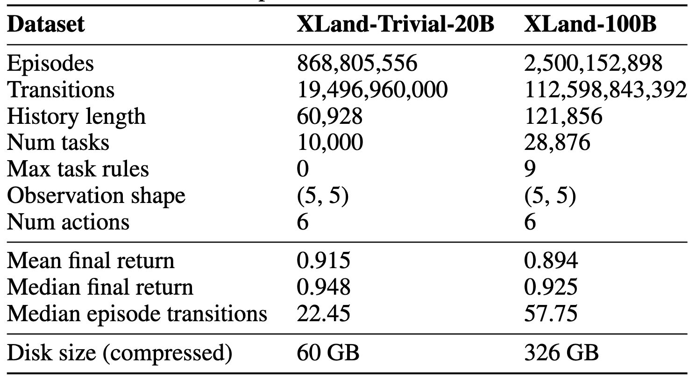

<h1 align="center"> XLand-100B: A Large-Scale Dataset for In-Context RL</h1>

<p align="center">
    <a href="https://arxiv.org/abs/2406.08973">
        
    </a>
</p>

Official code for the [XLand-100B: A Large-Scale Multi-Task Dataset for In-Context Reinforcement Learning](https://arxiv.org/abs/2406.08973), which presents two large datasets for in-context RL based on [XLand-MiniGrid](https://github.com/corl-team/xland-minigrid) environment: **XLand-100B** and a smaller version **XLand-Trivial-20B**. Together, they contain about 3.5B episodes, 130B transitions and 40,000 unique tasks, which is more than in any other dataset currently available in RL. Furthermore, our datasets are unique in that they contain the *complete training histories* of the base algorithms, rather than just expert transitions or partial replay buffers. With this datasets we aim to democratize research in the rapidly growing
field of in-context RL and provide a solid foundation for further scaling.

<p align="center">
    
</p>

As part of the code release, we provide the utilities used to collect the datasets as well as the code used for the experiments with AD and DPT methods. As these parts are not semantically related to each other, they are split into separate directories for ease of use.  See the README in each directory for instructions.

## Downloading the datasets

Both **XLand-100B** and **XLand-Trivial-20B** datasets hosted on public S3 bucket and freely available for everyone under CC BY-SA 4.0 Licence. 

We advise starting with Trivial dataset for debugging due to smaller size and faster downloading time. Both datasets have an identical structure. For additional details we refer to the paper. 

Datasets can be downloaded with the curl utility (or any other like wget) as follows:
```commandline
# XLand-Trivial-20B, approx 60GB size
curl -L -o xland-trivial-20b.hdf5 https://sc.link/A4rEW

# XLand-100B, approx 325GB size
curl -L -o xland-100b.hdf5 https://sc.link/MoCvZ
```

## What's inside

The datasets are stored in [hdf5](https://github.com/HDFGroup/hdf5) format. For each task, we provide 32 complete learning histories and all the metadata necessary for evaluation, such as environment, benchmark and task IDs from XLand-MiniGrid. Each learning history stores `states`, `actions`, `rewards`, `dones` and `expert_actions` sequentially, without splitting into individual episodes (for convenient cross-episode sequences sampling for training). `expert_actions` are relabeled with the final policy and needed for [DPT](https://arxiv.org/abs/2306.14892)-like methods (see paper for the details).

| Name           | Dtype      | Shape (XLand-Trivial-20B) | Shape (XLand-100B) |
|----------------|------------|---------------------------|--------------------|
| states         | np.uint8   | (32, 60928, 5, 5)         | (32, 121856, 5, 5) |
| actions        | np.uint8   | (32, 60928)               | (32, 121856)       |
| rewards        | np.float16 | (32, 60928)               | (32, 121856)       |
| dones          | np.bool    | (32, 60928)               | (32, 121856)       |
| expert_actions | np.uint8   | (32, 60928)               | (32, 121856)       |

**NB!** We have also compressed the observations to reduce the size of the dataset. The original observations from the XLand-MiniGrid have the shape (5, 5, 2), not (5, 5)!  After sampling, decompress them like that (see also dataloaders in the baselines):
```python
# see collection/training/utils.py
import numpy as np
from xminigrid.core.constants import NUM_COLORS

np.stack(np.divmod(obs, NUM_COLORS), axis=-1)
```

## Dependencies

We provide specific dependencies for experiments and data collection in the appropriate directories. However, we have also prepared a Dockerfile for easier setup of the working environment. It should containt all the necessary dependencies.

```
docker build . -t xland-dataset
docker run --itd --rm --gpus all -v $(pwd):/workspace --name xland-dataset xland-dataset
```

## Citing

If you use this code or datasets for your research, please consider the following BibTeX:

```
@article{nikulin2024xland,
  title={XLand-100B: A Large-Scale Multi-Task Dataset for In-Context Reinforcement Learning},
  author={Nikulin, Alexander and Zisman, Ilya and Zemtsov, Alexey and Sinii, Viacheslav and Kurenkov, Vladislav and Kolesnikov, Sergey},
  journal={arXiv preprint arXiv:2406.08973},
  year={2024}
}

```
